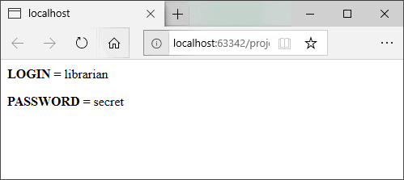
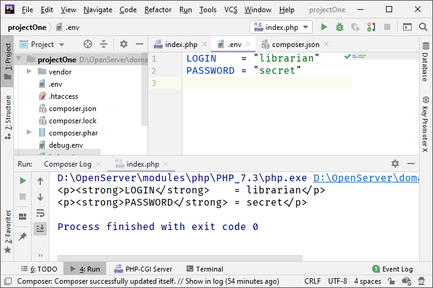
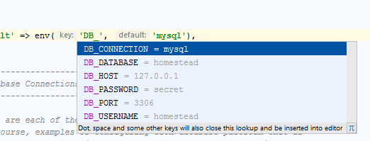

### .env-файлы

Давным-давно перед программистами и системными в полный рост встал вопрос, как хранить различные чувствительные настройки программы (например, логин/пароль к базе данных), так чтобы:

1. Было удобно отлаживать программу на машине разработчика;
2. Было удобно конфигурировать программу на сервере;
3. Эти самые чувствительные данные (особенно настройки для продакшена) не попали, например, в репозиторий, где их увидят те, кому их видеть не положено.

Было придумано много всяких подходов, один из которых — хранить настройки в текстовых файлах `.env` следующей структуры

```dotenv
# комментарий
KEY1 = "value1" # ещё комментарий
KEY2 = "value2"
...
```

На машине разработчика такой файл может содержать одни настройки, на сервере – совершенно другие, а благодаря тому, что эти файлы внесены в `.gitignore`, в репозиторий они не попадут.

Содержимое `.env`-файлов при необходимости легко превратить в строки окружения с помощью команды – сюрприз! – `source`:

```bash
$ source debug.env

echo 'если source не поддерживается оболочкой'

$ . debug.env
```

Кстати, если в Linux у вас в <code>.profile</code> есть строчка

<pre class="brush: plain">
export ENV=$HOME/.env
</pre>

то переменные из <code>.env</code>-файла превратятся в обычные переменные окружения. Малая механизация, так сказать. :)

Переходим к обсуждению, как с `.env`-файлами работают в PHP. Там для этого предусмотрен специальный пакет `PhpDotEnv`. Пусть у нас есть файл `.env` следующего содержания

```dotenv
LOGIN    = "librarian"
PASSWORD = "secret"
```

Мы включаем в свой `composer.json` строчку `vlukas/phpdotenv`:

```json
{
  "name": "amironov73/projectOne",
  "description": "description",
  "minimum-stability": "stable",
  "license": "MIT",
  "authors": [
    {
      "name": "Alexey Mironov",
      "email": "alexey@mironov.online"
    }
  ],
  "require": {
    "php": ">= 7.3",
    "vlucas/phpdotenv": "*"
  }
}
```

Теперь можно работать с содержимым `.env`:

```php
<?php

include __DIR__ . '/vendor/autoload.php';

$dotenv = \Dotenv\Dotenv::createImmutable(__DIR__);
$dotenv->load();

echo "<p><strong>LOGIN</strong>    = " . $_ENV['LOGIN']    . "</p>\n";
echo "<p><strong>PASSWORD</strong> = " . $_ENV['PASSWORD'] . "</p>\n";
```



Получать данные можно разными способами:

```php
echo getenv ('ADMIN_EMAIL', 'admin@mail.com');
echo $_ENV ['ADMIN_EMAIL'];
echo $_SERVER ['ADMIN_EMAIL'];
```

Можно заранее озаботиться существованием нужных нам переменных:

```php
// одна переменная
$dotenv->required('DATABASE_DSN');

// требуем, чтобы значение было не пустым
$dotenv->required('DATABASE_DSN')->notEmpty();

// целочисленная переменная
$dotenv->required('FOO')->isInteger();

// булева переменная
$dotenv->required('FOO')->isBoolean();

// несколько переменных
$dotenv->required(['DB_HOST', 'DB_NAME', 'DB_USER', 'DB_PASS']);
```

Если использовать метод `load()`, то `Dotenv` не будет перезаписывать переменные среды, которые уже установлены. Чтобы заставить его перезаписывать переменные среды, надо вызвать `overload()`.

Для PhpStorm имеется [специальный плагин](https://github.com/vlucas/phpdotenv), поддерживающий `.env`-файлы. Он подсвечивает синтаксис самих `.env`-файлов и выдаёт IntelliSense с именами параметров в PHP-файлах. Кроме того, он позволяет перейти от PHP к соответствующей строчке `.env`-файла и наоборот – от строки `.env`-файла к её использованию в PHP. Кроме PHP, плагин поддерживает JavaScript, Python, Go и Ruby. Согласитесь, здо́рово придумано.





Чтобы пользователям (например, тем же сисадминам) не нужно было ломать голову над тем, что писать в `.env`, в поставку принято включать файл вроде такого `.env.example`:

```dotenv
DB_CONNECTION=mysql
DB_HOST=127.0.0.1
DB_PORT=3306
DB_DATABASE=laravel
DB_USERNAME=librarian
DB_PASSWORD=secret
```

`.env`-файлы поддерживаются не только в PHP, но и в других языках:

* JavaScript dotenv package: https://github.com/motdotla/dotenv
* Python dotenv package: https://github.com/theskumar/python-dotenv
* Ruby dotenv gem: https://github.com/bkeepers/dotenv
* Go dotenv library: https://github.com/joho/godotenv
* NuGet package: https://github.com/tonerdo/dotnet-env