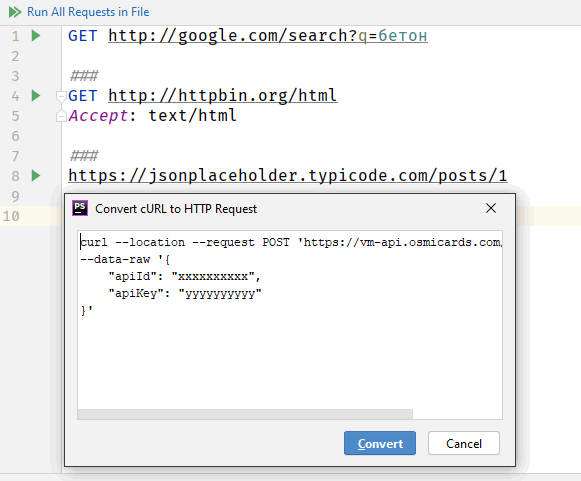

### HTTP Request в PhpStorm

В PhpStorm (впрочем, и в других IDE от JetBrains тоже, например, в Rider) есть замечательная возможность отлаживать HTTP-запросы с максимальным комфортом. Активируется она буквально в два клика мышкой: «New -> HTTP Request». Выглядит это так:


Что нам даёт JetBrains:

* Подсветка кода
* IntelliSense для многих элементов: хост, метод запроса, заголовки запроса и т. д.
* Сворачивание ненужных на данный момент частей запроса и ответа
* Инлайн-документация для заголовков запроса/ответа и тегов документа
* Просмотр структуры запроса/ответа
* «Вживление» языка программирования в тело запроса
* Рефакторинг
* «Живые» шаблоны

Мы можем сконвертировать командную строку cURL в HTTP Request:



Результат конвертирования


Структура HTTP-запроса такова:

```http request
# комментарий
// тоже комментарий
МЕТОД URL
Заголовки запроса (опционально)
 
Тело запроса (опционально)
###
```

Здесь `###` — ограничитель, отделяющий в файле один запрос от другого.

Длинные запросы можно разбивать по строкам, это не мешает PhpStorm:

```http request
// Using line breaks with indent
GET http://example.com:8080
    /api
    /html
    /get
    ?id=123
    &value=content
```

Пример запроса с заголовком:

```http request
### GET request with a header
GET https://httpbin.org/ip
Accept: application/json
```

Подстановка переменных окружения (см. кнопку «Add Environment File»)

```http request
### GET request with environment variables
GET {{host}}/get?show_env={{show_env}}
Accept: application/json
```

Файл с переменными окружения `http-client.env.json` выглядит примерно так

```json
{
    "development": {
        "host": "localhost",
        "id-value": 12345,
        "username": "",
        "password": "",
        "my-var": "my-dev-value"
    },
 
    "production": {
        "host": "example.com",
        "id-value": 6789,
        "username": "",
        "password": "",
        "my-var": "my-prod-value"
    }
}
```

Соответственно можно запускать запрос в окружениях «`development`» и «`production`».


Отключение редиректа:

```http request
### GET request with disabled redirects
# @no-redirect
GET http://httpbin.org/status/301
```

В URL запроса можно вставлять специальные макросы `$uuid`, `$timestamp`, `$randomInt`

```http request
GET http://httpbin.org/anything?id={{$uuid}}&ts={{$timestamp}}
```

Авторизация на сервере:

```http request
// Basic
GET http://example.com
Authorization: Basic username password
 
###
 
// Digest
GET http://example.com
Authorization: Digest username password
```

Cookie сохраняется в специальный файл между запусками запросов. Можно запретить сохранение cookie:

```http request
// @no-cookie-jar
GET example.com/api
```

Тело запроса можно брать из файла:

```http request
// The request body is read from a file
POST http://example.com:8080/api/html/post
Content-Type: application/json
 
< ./input.json
```

Запрос со сложносоставным телом (`multipart/form-data` во всей красе):

```http request
POST http://example.com/api/upload HTTP/1.1
Content-Type: multipart/form-data; boundary=boundary
 
--boundary
Content-Disposition: form-data; name="first"; filename="input.txt"
 
// The 'input.txt' file will be uploaded
< ./input.txt
 
--boundary
Content-Disposition: form-data; name="second"; filename="input-second.txt"
 
// A temporary 'input-second.txt' file with the 'Text' content will be created and uploaded
Text
--boundary
Content-Disposition: form-data; name="third";
 
// The 'input.txt' file contents will be sent as plain text.
< ./input.txt --boundary--
```

Кроме простого запуска запроса, поддерживается отладка PHP


Поддерживается создание конфигурации для запуска HTTP Request


Можно открыть результат запроса в браузере


В меню «Tools -> HTTP Client» есть пункт «Open HTTP Requests History», позволяющий просмотреть историю запросов в виде сохранённых файлов


а значит, появляется возможность сравнения результатов запросов друг с другом


Можно запретить сохранение результатов запроса в лог:

```http request
// @no-log
GET example.com/api
```

Работают «живые» шаблоны


при необходимости можно дополнить коллекцию «живых» шаблонов произвольным количеством собственных любой степени изощрённости.

Можно писать собственные обработчики ответа сервера


В обработчике нам доступны два объекта:

* **client** – собственно HTTP Client от JetBrains. Он предоставляет свойство client.global, в который можно складывать что угодно (например, `client.global.set(variableName, 'Something');`), а затем ссылаться в последующих запросах `{{variableName}}`. Также доступны методы client.log, client.assert, client.test.

* **response** – ответ сервера. Доступны свойства `status`, `body`, `contentType`, `headers`.

Таким образом, у нас есть инфраструктура для написания тестов:

```http request
GET https://httpbin.org/status/200
 
> 
```

Само собой, внутри обработчиков поддерживается полноценная технология IntelliSense с подсказками, подчёркиванием ошибок и т. п.

В одном `.http`-файле может быть произвольное количество HTTP-запросов, каждый из которых может содержать произвольное количество тестов. Запускать запросы можно как по одному, так и все скопом (по очереди). По факту мы имеем полноценную IDE для тестирования HTTP.

На Youtube есть [замечательный ролик с обзором HTTP Request](https://www.youtube.com/watch?v=n8KCuKhDSZY).
