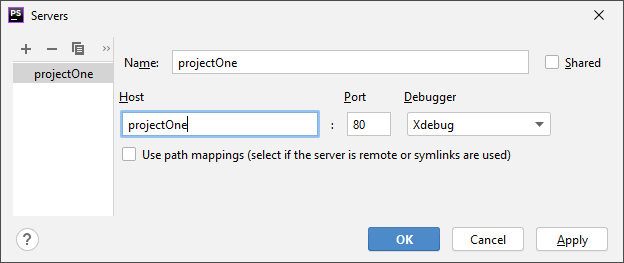
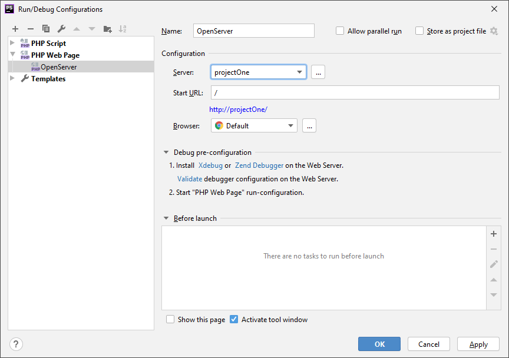

# PhpStorm и OpenServer

Рассказываю как для себя :) На примере самой свежей версии PhpStorm.

Идём на страницу https://ospanel.io/download/ и скачиваем OpenSever (я взял 5.3.7 Full). Устанавливаем, например, в папку `D:\OpenServer`. Выбираем нужные модули:


Разрешаем отладку скриптов, для этого нужно отредактировать `php.ini`, но делать это надо средствами самого OpenServer:


потому что, если отредактировать самому при помощи Far, то при следующем запуске `php.ini` будет заменён дефолтным.

Меняем две настройки: `zend_extension = xdebug`


и `xdebug.remote_enable = on`


Заводим в PhpStorm проект прямо внутри папки `D:\OpenServer\domains`


Обязательно перезапускаем OpenServer, чтобы он подхватил наши правки и новый домен. Для начала убеждаемся, что OpenServer видит наш домен


и PhpStorm подхватывает отладку в CLI-интерпретаторе


Теперь организуем отладку на живом веб-сервере. Заводим веб-сервер в PhpStorm



чтобы сослаться на него в отладочной конфигурации «Php Web Page»



Если всё настроено правильно, сервер легко пройдёт валидацию, т. е. будет пригодным для отладки страниц «вживую».


Поместим в папку проекта `.htaccess` следующего содержания (я взял его из соседней папки localhost)

```apacheconfig
<IfModule dir_module>
    DirectoryIndex index.php index.html
</IfModule>
AddDefaultCharset UTF-8
AddCharset UTF-8 .html
<FilesMatch "\.(html)$">
   Header set Cache-Control: "no-cache, no-store"
   Header unset ETag
</FilesMatch>
Header set X-Content-Type-Options nosniff
```

пишем очень сложный скрипт index.php, на котором будем тренироваться :)

```php
<?php

$x = 123;
$y = 456;
$z = $x + $y;

echo "<p><strong>$x + $y = $z</strong>, как это ни странно!</p>";
```

Запускаем отладку, вуаля, точки останова и просмотр переменных отлично работают!


Наш скрипт в браузере


Всё вышеописанное работает в PhpStorm 2020.1

